# NLADR Database Architecture & Data Dictionary
### National Legal & Investigation Document Repository
**Department of Legal & Administrative Affairs — Ministry of Law & Justice, Government of India**  
**Smart India Hackathon (SIH) 2026**

---

## 1. Executive Summary & Design Principles

The **NLADR Database Engine** is engineered as a **Sovereign, Zero-Trust Relational Architecture** tailored to the strict evidentiary and procedural requirements of the Indian Criminal Justice System. 

### Core Architectural Pillars:
1. **Cryptographic Non-Repudiation**: Every document, FIR, charge sheet, and forensic report is indexed with an immutable 256-bit SHA-256 mathematical digest.
2. **Dual-Vault Physical-Digital Synchronization**: Relational mapping binds digital dockets directly to physical warehouse storage coordinates (Vault ID, Rack Number, Shelf Label, RFID/Barcode).
3. **Statutory Admissibility**: Built from the ground up to comply with **Section 63 of Bharatiya Sakshya Adhiniyam 2023 (BSA)** and **Section 65B of Indian Evidence Act 1872**.
4. **Zero-Trust Auditability**: Every state transition, transfer of custody, or access attempt generates an immutable, tamper-evident audit record with IP provenance and timestamp chaining.

---

## 2. Entity-Relationship (ER) Diagram

```mermaid
erDiagram
    USERS ||--o{ CASES : "assigned as IO / Legal / Record Officer"
    USERS ||--o{ REGISTRATION_REQUESTS : "reviews"
    USERS ||--o{ EVIDENCE_DOCUMENTS : "uploads"
    USERS ||--o{ CHAIN_OF_CUSTODY : "transfers / receives"
    USERS ||--o{ AUDIT_LOGS : "acts"
    USERS ||--o{ CITIZEN_GRIEVANCES : "submits"
    
    CASES ||--|| PHYSICAL_VAULT_LOCATIONS : "physically archived in"
    CASES ||--o{ CASE_TEAM_MEMBERS : "investigated by"
    CASES ||--o{ EVIDENCE_DOCUMENTS : "contains"
    CASES ||--o{ INVESTIGATION_FINDINGS : "logs case diary in"
    CASES ||--o{ CITIZEN_GRIEVANCES : "receives"
    
    EVIDENCE_DOCUMENTS ||--o{ CHAIN_OF_CUSTODY : "tracked via"
    
    USERS {
        varchar(50) id PK
        varchar(100) username UK
        varchar(150) name
        varchar(50) role
        varchar(200) designation
        varchar(200) department
        varchar(100) badge_number
        varchar(150) email UK
        varchar(30) phone
        varchar(20) aadhaar_masked
        varchar(20) status
        timestamp approved_at
    }

    CASES {
        varchar(50) id PK
        varchar(100) case_number UK
        varchar(150) fir_number
        varchar(255) title
        varchar(100) category
        text statute_sections
        varchar(150) complainant_name
        varchar(50) complainant_id FK
        varchar(50) assigned_io_id FK
        varchar(50) assigned_legal_officer_id FK
        varchar(50) record_officer_id FK
        varchar(50) status
        varchar(20) priority
        int progress_percent
        date filing_date
        varchar(200) court_name
        varchar(150) presiding_judge
    }

    PHYSICAL_VAULT_LOCATIONS {
        varchar(50) id PK
        varchar(50) case_id FK,UK
        varchar(100) vault_number
        varchar(50) rack_number
        varchar(50) shelf_number
        varchar(50) security_classification
        varchar(100) barcode_rfid_tag UK
        varchar(50) custodian_user_id FK
        boolean tamper_seal_intact
    }

    EVIDENCE_DOCUMENTS {
        varchar(50) id PK
        varchar(50) case_id FK
        varchar(255) document_name
        varchar(100) document_type
        varchar(50) file_size_human
        varchar(64) sha256_hash
        boolean tamper_verified
        varchar(50) access_level
        boolean sec_65b_certificate_issued
        varchar(64) sec_65b_cert_hash
        varchar(50) uploaded_by_user_id FK
        timestamp uploaded_at
    }

    CHAIN_OF_CUSTODY {
        varchar(50) id PK
        varchar(50) document_id FK
        varchar(50) case_id FK
        varchar(50) transferred_from_user_id FK
        varchar(50) transferred_to_user_id FK
        varchar(150) sender_name
        varchar(150) recipient_name
        varchar(255) custody_reason
        varchar(64) sha256_verified_at_transfer
        varchar(30) verification_status
        timestamp transfer_timestamp
    }

    INVESTIGATION_FINDINGS {
        varchar(50) id PK
        varchar(50) case_id FK
        varchar(150) author_name
        varchar(50) author_user_id FK
        varchar(255) title
        text description
        varchar(100) tag
        date entry_date
    }

    AUDIT_LOGS {
        varchar(50) id PK
        timestamp timestamp
        varchar(150) actor_name
        varchar(100) actor_role
        varchar(150) action
        varchar(255) target
        varchar(50) ip_address
        varchar(100) hash_verification
        varchar(64) event_sha256
    }
```



---

## 3. Data Dictionary & Table Definitions

### 3.1 Table: `users`
Stores all authenticated sovereign actors in the criminal justice lifecycle.

| Column | Type | Constraints | Description |
|---|---|---|---|
| `id` | VARCHAR(50) | PRIMARY KEY | Unique user identity code (`USR-IO-001`, `USR-LEG-001`) |
| `username` | VARCHAR(100) | UNIQUE, NOT NULL | Government portal login handle |
| `name` | VARCHAR(150) | NOT NULL | Full gazetted name and credentials |
| `role` | VARCHAR(50) | NOT NULL, CHECK | Role (`Administrator`, `Investigator Officer`, `Legal Officer`, `Record Officer`, `Citizen`, `Forensic Analyst`) |
| `designation` | VARCHAR(200) | NOT NULL | Official rank (e.g., SP, Public Prosecutor, Chief Archivist) |
| `department` | VARCHAR(200) | NOT NULL | Branch / Ministry affiliation |
| `badge_number`| VARCHAR(100) | NULLABLE | Service card number (e.g., `IPS-2012-DL-8841`) |
| `email` | VARCHAR(150) | UNIQUE, NOT NULL | Official Government / NIC / personal email |
| `phone` | VARCHAR(30) | NOT NULL | Contact telephone |
| `status` | VARCHAR(20) | DEFAULT 'Active' | Account life-cycle status (`Active`, `Suspended`, `Pending`) |

---

### 3.2 Table: `cases`
The central registry of legal and investigative dockets under active prosecution or trial.

| Column | Type | Constraints | Description |
|---|---|---|---|
| `id` | VARCHAR(50) | PRIMARY KEY | Case internal tracking ID (`CAS-2026-0101`) |
| `case_number` | VARCHAR(100) | UNIQUE, NOT NULL | National repository index number (`NLADR/2026/EOW-0101`) |
| `fir_number` | VARCHAR(150) | NOT NULL | Police Station FIR citation |
| `title` | VARCHAR(255) | NOT NULL | Case title (e.g., *State vs. Apex Tech Synthetics*) |
| `category` | VARCHAR(100) | NOT NULL | Crime classification (Economic Offences, Cyber Crime, Corruption) |
| `statute_sections`| TEXT | NOT NULL | Statutory invocations under BNS, BNSS, IT Act |
| `assigned_io_id`| VARCHAR(50) | FK -> users(id) | Lead Investigating Officer |
| `assigned_legal_officer_id`| VARCHAR(50) | FK -> users(id) | Prosecuting Government Counsel |
| `record_officer_id`| VARCHAR(50) | FK -> users(id) | Custodian of physical warehouse exhibits |
| `status` | VARCHAR(50) | NOT NULL | `Under Investigation`, `Charge-sheet Filed`, `In Trial`, `Solved/Disposed` |
| `progress_percent`| INT | CHECK 0-100 | Investigation & trial completion benchmark |
| `court_name` | VARCHAR(200) | NOT NULL | Designated court of competent jurisdiction |
| `presiding_judge`| VARCHAR(150) | NOT NULL | Name of the Presiding Judge |

---

### 3.3 Table: `evidence_documents`
The cryptographically authenticated digital evidence locker.

| Column | Type | Constraints | Description |
|---|---|---|---|
| `id` | VARCHAR(50) | PRIMARY KEY | Document unique index (`DOC-2026-001`) |
| `case_id` | VARCHAR(50) | FK -> cases(id) | Associated case docket |
| `document_name`| VARCHAR(255) | NOT NULL | Standardized file descriptor |
| `document_type`| VARCHAR(100) | NOT NULL | Type (`FIR Dossier`, `Forensic Evidence`, `Charge Sheet`, `Seizure Memo`) |
| `file_size_human`| VARCHAR(50) | NOT NULL | Display size (e.g., `14.8 MB`) |
| `sha256_hash` | VARCHAR(64) | NOT NULL | **256-bit cryptographic digest calculated on upload** |
| `tamper_verified`| BOOLEAN | DEFAULT TRUE | Continuous background verification status |
| `access_level` | VARCHAR(50) | NOT NULL | `Public Record`, `Restricted`, `Confidential`, `Secret`, `Classified` |
| `sec_65b_certificate_issued`| BOOLEAN | DEFAULT FALSE | Section 63 BSA / Sec 65B IEA Certificate generated |
| `sec_65b_cert_hash`| VARCHAR(64)| NULLABLE | SHA-256 signature of the forensic certificate |

---

### 3.4 Table: `chain_of_custody`
Guarantees unbroken provenance and custody handovers across institutions.

| Column | Type | Constraints | Description |
|---|---|---|---|
| `id` | VARCHAR(50) | PRIMARY KEY | Chain of Custody entry (`COC-2026-001`) |
| `document_id` | VARCHAR(50) | FK -> evidence_documents(id)| Target evidence |
| `case_id` | VARCHAR(50) | FK -> cases(id) | Case reference |
| `sender_name` | VARCHAR(150) | NOT NULL | Officer transferring evidence |
| `recipient_name`| VARCHAR(150) | NOT NULL | Receiving authority (CFSL, Court, Prosecutor) |
| `custody_reason`| VARCHAR(255) | NOT NULL | Purpose of transfer (Forensic analysis, Filing) |
| `sha256_verified_at_transfer`| VARCHAR(64)| NOT NULL | Cryptographic checksum calculated at receipt |
| `verification_status`| VARCHAR(30)| NOT NULL | `VERIFIED_MATCH`, `INTEGRITY_MISMATCH` |
| `transfer_timestamp`| TIMESTAMP | NOT NULL | Instantaneous UTC timestamp |

---

## 4. Key Production SQL Queries for SIH Demonstration

### Query A: Verify Chain of Custody & Hash Integrity for Case Docket
```sql
SELECT 
    c.case_number,
    d.document_name,
    d.document_type,
    d.sha256_hash AS original_hash,
    coc.sender_name,
    coc.recipient_name,
    coc.custody_reason,
    coc.sha256_verified_at_transfer AS verified_hash,
    CASE 
        WHEN d.sha256_hash = coc.sha256_verified_at_transfer THEN 'AUTHENTIC / TAMPER-PROOF'
        ELSE 'ALERT: INTEGRITY VIOLATION DETECTED'
    END AS forensic_admissibility_status
FROM evidence_documents d
JOIN cases c ON d.case_id = c.id
JOIN chain_of_custody coc ON d.id = coc.document_id
WHERE c.case_number = 'NLADR/2026/EOW-0101'
ORDER BY coc.transfer_timestamp ASC;
```

### Query B: Dual-Vault Physical Coordinate Retrieval
```sql
SELECT 
    c.case_number,
    c.title,
    c.status,
    p.vault_number,
    p.rack_number,
    p.shelf_number,
    p.security_classification,
    p.barcode_rfid_tag,
    p.tamper_seal_intact
FROM cases c
JOIN physical_vault_locations p ON c.id = p.case_id
WHERE p.tamper_seal_intact = TRUE;
```

---

## 5. Deployment Guide

1. **PostgreSQL / Supabase**:
   ```bash
   psql -U postgres -d nladr_db -f schema.sql
   psql -U postgres -d nladr_db -f seed.sql
   ```
2. **SQLite**:
   ```bash
   sqlite3 nladr.db < schema.sql
   sqlite3 nladr.db < seed.sql
   ```
3. **PowerShell Verification**:
   ```powershell
   powershell -ExecutionPolicy Bypass -File .\init_database.ps1
   ```
